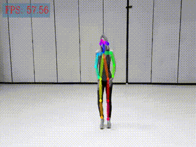

# PoseEstimation C++ Demo 
Achieve relative code about caffe pose estimation model by c++ 

## Basic Processes 
    - class initiation(caffe model load)
    - image read 
    - pose estimation 
        - preprocess 
        - model inference 
        - postprecess 
    - pose render  
    - image display 
    - video display

## demo 
 

## make 
cd build  
cmake -DCMAKE_BUILD_TYPE=Debug  ..    
make  
./pose_estimation model_file.prototxt trained_model.caffemodel /path/to/img.png   

## speed 
- model inference time: 10ms 
- total time: 18ms(include preprocess and postprecess)

## caffe(with depthwise conv)
Caffe_DIR="/ssd2/xyliu/projects/caffe/build/install/share/Caffe"

## user mode 
export LD_LIBRARY_PATH="/ssd2/xyliu/projects/caffe/build/install/lib/":$LD_LIBRARY_PATH 

## doc 
doc/caffe_depthconv.md
